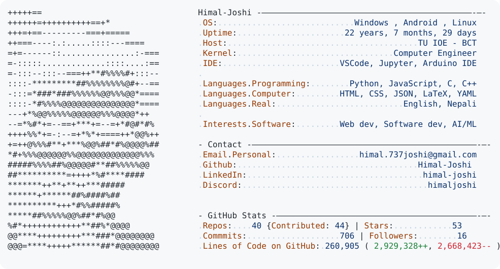

<!-- 

  

 -->

<a href="https://github.com/Himal-Joshi/Himal-Joshi">
  <picture>
    <source media="(prefers-color-scheme: dark)" srcset="dark_mode.svg">
    
  </picture>
</a>

  

## 👨‍💻 About Me

 Hi 👋, I'm Himal Joshi, a Computer Engineering student and self-taught developer passionate about building software and exploring emerging technologies. I enjoy turning ideas into practical projects, from web applications and machine learning solutions to open-source contributions. My interests include software development, cybersecurity, artificial intelligence, computer vision, and data-driven technologies. Through academic projects, technical workshops, and continuous learning, I'm constantly improving my skills and building solutions that make an impact.

- 👨‍💻 All of my projects are available at **[https://himaljoshi.info.np](https://himaljoshi.info.np)**

<h3 align="left">🌟Connect with me:</h3>

<h3 align="left">Languages and Tools:</h3>

                                  

<h2 align="center">🏆 Github Profile Stats</h2>
 

<!-- 

&nbsp;
 -->

![]&nbsp;&nbsp;&nbsp;&nbsp;&nbsp;(https://github-readme-stats.shion.dev/api/top-langs/?username=himal-joshi&theme=dark&hide_border=false&include_all_commits=false&count_private=false&layout=compact)&nbsp;&nbsp;&nbsp;&nbsp;&nbsp;&nbsp;

<!-- 

 -->

 

    
    

  

  

